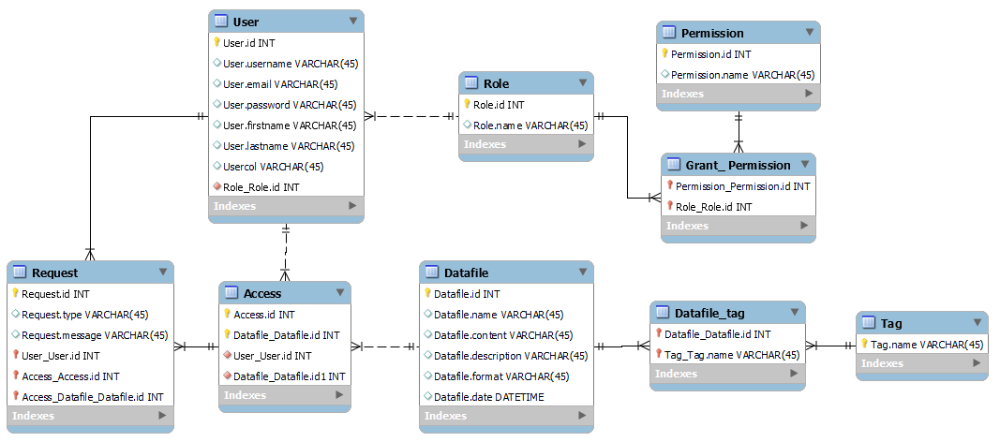

# Проєктування бази даних

## Модель бізнес-об'єктів

@startuml
    entity User <<ENTITY>> #88FFAE
    entity User.id <<NUMBER>> #FFFFFF
    entity User.login <<TEXT>> #FFFFFF
    entity User.firstname <<TEXT>> #FFFFFF
    entity User.lastname <<TEXT>> #FFFFFF
    entity User.email <<TEXT>> #FFFFFF
    entity User.password <<TEXT>> #FFFFFF
    
    entity Role <<ENTITY>> #88FFAE
    entity Role.id <<NUMBER>> #FFFFFF
    entity Role.name <<TEXT>> #FFFFFF
    
    entity Permission <<ENTITY>> #88FFAE
    entity Permission.id <<NUMBER>> #FFFFFF
    entity Permission.name <<TEXT>> #FFFFFF
    
    entity Grant_Permission <<ENTITY>> #88FFAE
    
    entity Request <<ENTITY>> #88FFAE
    entity Request.id <<NUMBER>> #FFFFFF
    entity Request.type <<NUMBER>> #FFFFFF
    entity Request.message <<TEXT>> #FFFFFF
    
    entity Access <<ENTITY>> #88FFAE
    entity Access.id <<NUMBER>> #FFFFFF
    
    entity Datafile <<ENTITY>> #88FFAE
    entity Datafile.id <<NUMBER>> #FFFFFF
    entity Datafile.name <<TEXT>> #FFFFFF
    entity Datafile.content <<TEXT>> #FFFFFF
    entity Datafile.description <<TEXT>> #FFFFFF
    entity Datafile.format <<TEXT>> #FFFFFF
    entity Datafile.date <<DATETIME>> #FFFFFF
    
    entity Tag <<ENTITY>> #88FFAE
    entity Tag.id <<NUMBER>> #FFFFFF
    entity Tag.name <<TEXT>> #FFFFFF
    
    entity Datafile_tag <<ENTITY>> #88FFAE
    
    User *-u- User.id
    User *-u- User.login
    User *-u- User.firstname
    User *-u- User.lastname
    User *-u- User.email
    User *-u- User.password
    
    Role *-d- Role.id
    Role *-d- Role.name
    
    Permission *-u- Permission.id
    Permission *-u- Permission.name
    
    Request *-u- Request.id
    Request *-u- Request.type
    Request *-u- Request.message
    
    Access *-d- Access.id
    
    Datafile *-d-- Datafile.id
    Datafile *-d-- Datafile.name
    Datafile *-d-- Datafile.content
    Datafile *-d-- Datafile.date
    Datafile *-d-- Datafile.description
    Datafile *-d-- Datafile.format
    
    Tag *-u- Tag.id
    Tag *-r- Tag.name
    
    User "0,*"-d-"1,1" Role
    
    Permission "1,1"-r-"0,*" Grant_Permission
    Grant_Permission "0,*"-r-"1,1" Role
    
    User "1,1"-d-"0,*" Access
    
    User "1,1"-u-"0,*" Request
    
    Request "0,*"-r-"1,1" Access
    
    Access "0,*"-r-"1,1" Datafile
    
    Datafile "1,1"-r-"0,*" Datafile_tag
    Datafile_tag "0,*"-r-"1,1" Tag
@enduml

## ER-модель

@startuml  
    entity User <<ENTITY>>{ 
        User.id:NUMBER 
        User.username:TEXT 
        User.email:TEXT 
        User.password:TEXT 
        User.firstname:TEXT 
        User.lastname:TEXT 
    }
    
    entity Role <<ENTITY>>{ 
        Role.name:TEXT 
        Role.id:NUMBER 
    }
    
    entity Permission <<ENTITY>> {
        Permission.id:NUMBER
        Permission.name:TEXT
    }
    
    entity Grant_Permission <<ENTITY>> {
    }
    
    entity Request <<ENTITY>> {
        Request.id:NUMBER
        Request.type:TEXT
        Request.message:TEXT
    }
    
    entity Access <<ENTITY>>{ 
        Access.id:NUMBER 
    }
    
    entity Datafile <<ENTITY>> { 
        Datafile.id:NUMBER 
        Datafile.name:TEXT 
        Datafile.content:TEXT 
        Datafile.description:TEXT 
        Datafile.format:TEXT 
        Datafile.date:NUMBER    
    }
    
    entity Datafile_tag <<ENTITY>>{ 
    }
    
    entity Tag <<ENTITY>>{ 
        Tag.name:TEXT 
    }
    
    User"0,*" -- "1,1"Role
    
    Permission "1,1"--"0,*" Grant_Permission
    Grant_Permission "0,*"--"1,1" Role
    
    User "1,1"--"0,*" Request
    
    User"1,1" -- "0,*"Access
    
    Request "0,*"-r-"1,1" Access
    
    Access"0,*" -- "1,1"Datafile 
    Datafile"1,1" -r- "0,*"Datafile_tag 
    Datafile_tag"0,*" -r- "1,1"Tag 
@enduml

## Реляційна схема

